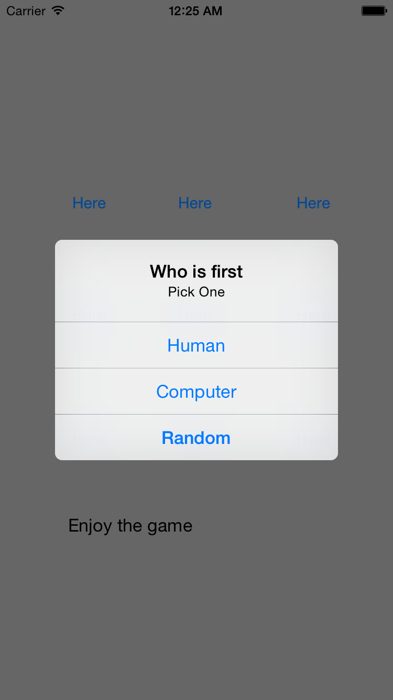

# Tic Tac Toe

+ Description
  - simple game implementation
  - focus on logic, not physical appearance
  - game mode
    + human vs. computer
    + two human players
  - rules
    + player can select who will go first, or pick randomly
    + computer will decide its next move to maximize the possibility to win, be careful playing against him
    + player can choose to play again after game ends
    + reminder message pops out if you pick the wrong spot to move

+ Screeshots
  - 
  - 
  - 
  - 
